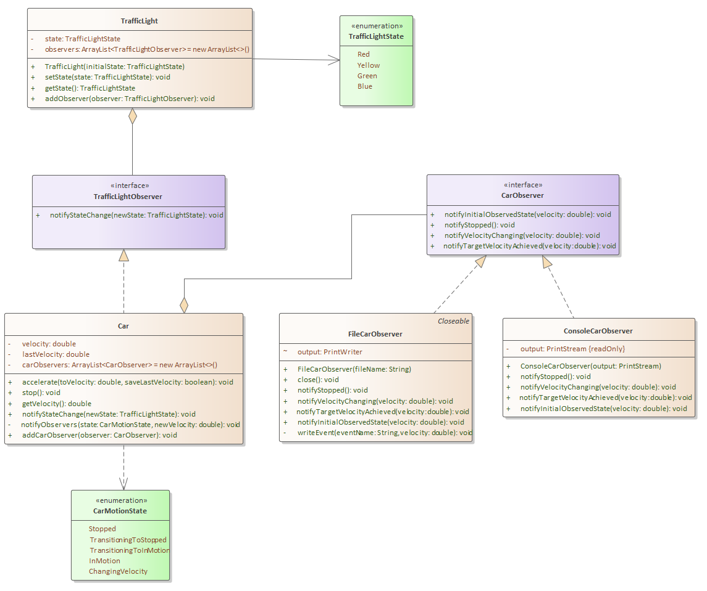

# Problem1 - Traffic Light System

## Problem Description

You will create an object-oriented system that simulates car and traffic lights with event monitoring for both (e.g. Car changes velocity, Traffic light changes)

**Problem Context**

This system is a simulator for various observable events that might happen in a traffic system. We implement a design pattern here called the Observer Pattern wherein an object can subscribe to events that may occur in another object.  As an example, a car can subscribe to traffic light events or we can have an out

## 

**Explanation of  Classes and Relationships**

- TrafficLightObserver interface - Any class (e.g. a Car) that implements this interface will be notified when the TrafficLightChanges and can respond (e.g. stopping, slowing down, or continuing)
- TrafficLight - Simulates a traffic light. Allows cars, for example, to subscribe (addObserver) to traffic light changes and notifies them upon a change the traffic light state
- Car - Simulates a car. Implements TrafficLightObserver and can receive events from multiple traffic lights (although more than one at a time is probably not practical). 
- CarObserver interface - Any class that implements this interface will be notified of specific events (initial velocity, velocity changing, velocity achieved, velocity reached).
- FileCarObserver - A CarObserver that writes to a file whenever it receives car events
- ConsoleCarObserver - A CarObserver that writes car events to a console. The ConsoleCarObserver should be initialized with System.out as a constructor argument, but should not call System.out directly

## Requirements

- In the **edu.sbcc.cs105.p1** folder, create your code

- Put any client code in Problem1.java **run** method.

- Car

  - Allow adding multiple CarObservers via the addCarObserver method. Adds them to an internal list
  - Anytime accelerate or stop is called, it will notify all of  its observers (enhanced for loop) of the appropriate event. Note, that accelerate is called with a negative value when you want to slow the car down.

- TrafficLight

  - Allow adding multiple TrafficLightObservers via the addObserver method. Adds them to an internal list
  - Calls the TrafficLightObserver instance method of notifyStateChange for all its observers whenever setState is called

  

## Testing Your Code

Sample code is provided for you in the Problem1.java class

