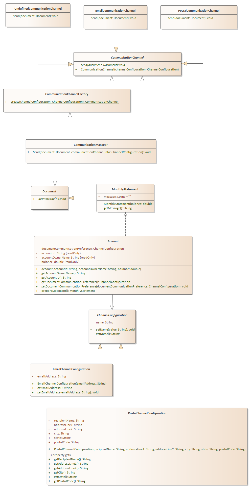

D

# Problem 2 - Document Communication Manager

## Problem Context

You are creating system that provides a flexible way for accounts (could be a bank, but we don't know or really care) to have associated documents communicated via a customer designated communication channel.  This channel could be email, postal, dropbox, the possibilities are endless.  A key requirement is that new communication channels can be added without modifying existing code. We therefore use abstract classes to allow creating new channels that are self-contained in a class that extends the CommunicationChannel interface. Because each communication channel will have different configuration data (e.g. physical mailing address versus email address), there will be a ChannelConfiguration abstract class and corresponding implementations for each communication channel (e.g. EmailChannelConfiguration). While this system design is oversimplified, it will give you a chance to practice working with inheritance. Mostly, this could be done with interfaces since the CommunicationChannel implementations are very different for each.

## Instructions

1. In the **edu.sbcc.cs105.p2** folder, create your Java class files

2. Put any client code in Problem2.java **run** method. Client code means code that runs / tests your solution. 

3. When ready to run, change the problemId in Program.main to "p2"

4. Convert the UML class above to code. Names of the class, method, and parameters must all be correctly spelled including the case of the letters (upper / lower)

5. Implement the classes and methods as specified below

   

### Classes and Methods

1. CommunicationChannel - Interface
   1. send() - Specifies a contract to send a specified Document using the provided ChannelConfiguration provided in the constructor
      1. Document - Abstract class representing any kind of document (e.g. Monthly statement)
2. EmailCommunicationChannel - sends the provided document via email. Simply a print a messsage to the console that you are sending via email with the provided email address
3. PostalCommunicationChannel - sends the provided document via physical mail post. Simply a print a messsage to the console that you are sending via postal with the provided physical address
4. UndefinedCommunicationChannel - writes a message to the console that the communication channel is unknown.  
5. CommunicationChannelFactory - creates a new instance of the correct CommunicationChannel based upon the name of the provided ChannelConfiguration.  if an unknown ChannelConfiguration is provided, creates an UndefinedCommunicationChannel object
6. CommunicationChannelInfo
7. EmailChannelConfiguration  - Implement this class as specified. Realizes CommunicationChannelInfo
8. PostalChannelConfiguration  - Implement this data class as specified. Realizes CommunicationChannelInfo
9. Document - Provided for you
10. MonthlyStatement - Provided for you
11. Account - Provided for you

## Testing Your Code

Test code is provided for you in the Program2.java class