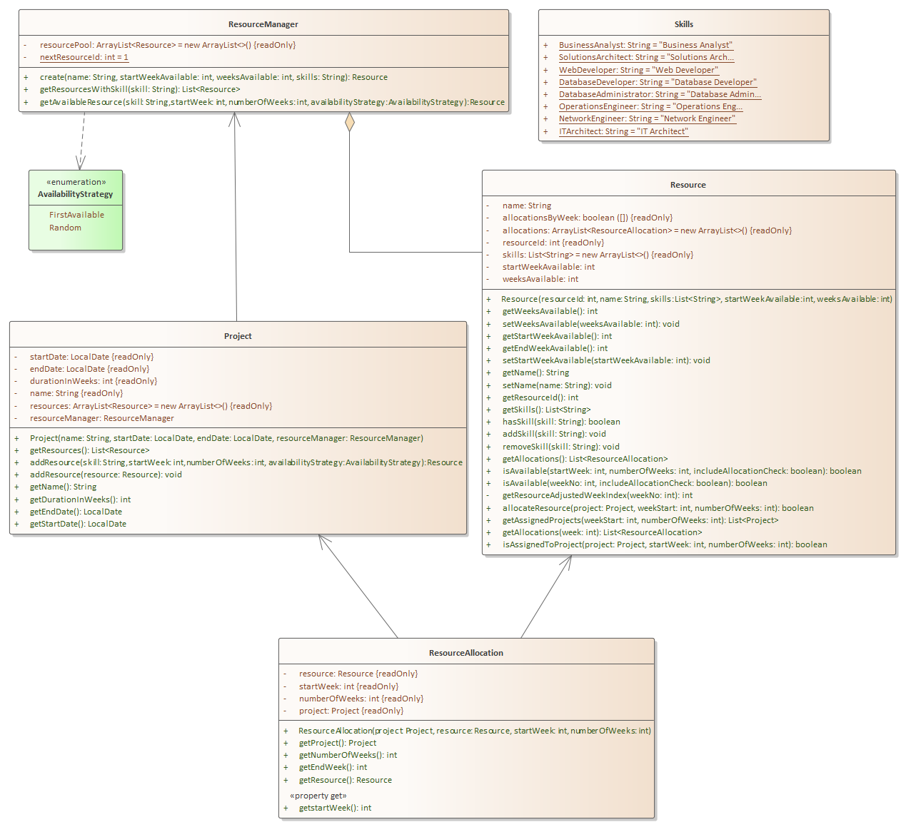

# Problem 3 - Project Resource Manager

## Problem Context

You are creating an application that allows project managers to create, assign, and manage resources for a project based upon skills needed during a specific timeframes defined in weeks.  The system allows for creating a resource (person) with a set of skills and availability in a starting week for a given number of weeks. The system also allows for requesting to add a resource of a given skill type for a given period of the project.  Due to the need to reduce complexity, it is assumed all projects created start at the same time so that the starting week number specified for adding a resource is consistent across the projects. This is admittedly a naïve implementation, but the additional logic would be too much. 

Use the UML Diagram below to create the solution for the problem specified implementing the requirements below.

## Instructions

1. In the **edu.sbcc.cs105.p3.model** folder, create your Java class files
2. Put any client code in Problem3.java **run** method. Client code means code that runs / tests your solution. 
3. When ready to run, change the problemId in Program.main to "p3"
4. Convert the UML class above to code. Names of the class, method, and parameters must all be correctly spelled including the case of the letters (upper / lower)
5. Implement the classes and methods as specified below

### Classes and Methods

1. Resource - A person with a set of skills available for use within a given time frame

   Methods

   - Standard accessors / mutators and simple add/remove methods for skills
   - isAvailable(startWeek, numberOfWeeks, includeAllocationCheck) - Determines whether the resource is generally available for the specified timeframe simply from their start and duration, Allocation check also determines whether they have already been allocated
   - isAvailable(weekNo, includeAllocationCheck) - Checks their availability for a single week. Used by the other isAvailable method
   - allocateResource(project,  int startWeek,  int numberOfWeeks) - allocates the resource to the specified project for the specified timeframe. Checks availability before allocating. Updates both the allocation array and the allocation list of the resource.
   - getAssignedProjects - returns a list of projects the resource is assigned to. Uses the resource allocation data to compile this
   - getAllocations - returns a list of allocations for the resource.
   - getResourceAdjustedWeekIndex - private method which converts a project week number into a resource week index for the array since their start week may be later than the project week.
   - isAssignedToProject(project) - checks resource allocations to determine if resource is assigned to a given project.

2. Project - An endeavor with a defined start and end date and tangible outcome 

   Methods

   - Constructor(name, startDate, endDate, resourceManager) - initializes instance data from the provided arguments. Calculates the number of weeks from the start and end date using the ChronoUnit.WEEKS.between method. 
   - addResource(skill, startWeek, numberOfWeeks, availabilityStrategy) - Uses the resource manager to find an available resource with the requested skills using the specfied availability strategy. Assigns that resource, if available, to the project. Returns null if no resource available
   - addResource(resource) - adds a specified resource to the project without doing any availability checks
   - getResources() - returns all resources currently assigned to the project

3. ResourceAllocation - Represents a resource assigned to a project during a given period - Simple data class with no logic.

4. ResourceManager - A collection of resources.  Enables adding new resources, finding resources with a particular skill (regardless of availability), or finding a resource with a skill that is available during a particular time.

   Methods

   - create(name, startWeekAvailable, weeksAvailable, skills) - Creates a resource based upon the provided parameters and adds it to its internal resource pool
   - getResourcesWithSkill(skill) - Returns a list of resources with the specified skill
   - getAvailableResource(String skill, int startWeek, int numberOfWeeks, AvailabilityStrategy availabilityStrategy)

5. AvailabilityStrategy - An enumeration used when determining availability checks - first available or random from a list of possible resources with the necessary skill

6. Skills - A simple class for holding constants for different skills.  For example, Skills.WebDeveloper = "Web Developer"

## Testing Your Code

I have a provided basic testing code in the Problem3.java run method

